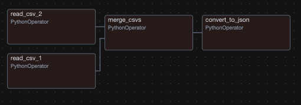

# Airflow demo

##  Overview
This repo is a simple Apache Airflow pipeline that 
- reads in two small csv files
- merges them
- converts the merged result into a json file
- saves that json file

The repo runs in a Docker container, and is configured using a docker-compose.yml file.

##  Prerequisites
- Docker
- Docker Compose    

## Installation
Follow the instructions [here](https://airflow.apache.org/docs/apache-airflow/stable/howto/docker-compose/index.htmlt) to install Airflow using Docker.

## Running this repo
1. Clone this repo
2. Run `docker-compose up`
3. Open the Airflow UI at `http://localhost:8080` (user/pass: `airflow`/`airflow`)
4. In the main Airflow page, locate on the `split_merge_csv_dag` DAG
5. Click on the `Graph View` button to see the DAG's flow

6. Click on the `Trigger DAG` Play button (top right of the window) to run the DAG
7. Observe the output file `data/merged.json`.  It should look like this (partially shown):
```
[
    {
        "id":1,
        "age":25.0,
        "city":null,
        "name":"Alice"
    },
    {
        "id":2,
        "age":30.0,
        "city":null,
        "name":"Bob"
    },
    {
        "id":3,
        "age":35.0,
        "city":"New York",
        "name":"Charlie"
    },
```
8. Note the usage of `xcom_push` and `xcom_pull` to pass data between tasks in the code.  Note the usage if `ti` to access the task instance.

Retriablility:
- Note the usage of `retries` and `retry_delay` to make the DAG more robust in the task `task_read_csv_1`.  Upon failing the max number of `retries`, a callback function `on_failure_callback` can be used, for example, to send an email notification.

Retrying failed tasks can be done manually by clicking on the task in the Airflow UI and clicking the `Retry` button.

## Running tests
1. Run `pytest tests/test_merge_csv_dag.py` in the root directory to run the tests

##  Tearing down the container
1. Run `docker-compose down` to tear down the container
